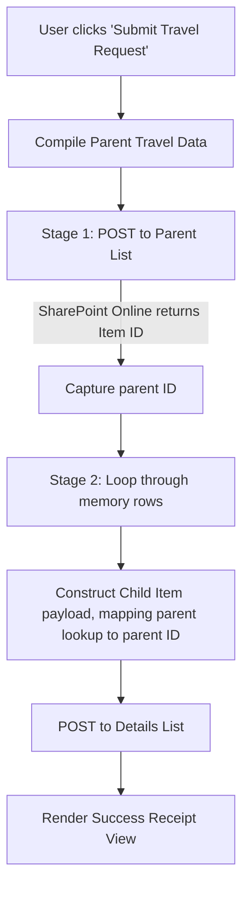

# Custom Travel Request SPFx Web Part

This directory contains the custom **SharePoint Framework (SPFx)** client-side web part for the Travel Request Approval System. Built with **React** and styled with Fluent UI design aesthetics, this component provides a premium, unified transaction form allowing employees to submit a parent travel request and multiple estimated cost items (flights, accommodation, meals, etc.) in a single step.

---

## ⚙️ Build Environment & Toolchain

This project is built using modern front-end build rigs and templates:
*   **SPFx Framework Version:** `1.22.0` (Latest enterprise standard)
*   **Node.js Requirement:** `>=22.14.0 < 23.0.0`
*   **React Version:** `17.0.1`
*   **Build Toolchain:** **Heft** (`@rushstack/heft`) extending the `@microsoft/spfx-web-build-rig` profiles.
*   **Target Output:** Built assets compile to `./lib` and `./dist`, and are packaged into `./solution/custom-travel-request.sppkg`.

---

## 🚀 Available Development Scripts

Run the following commands inside this directory:

### 1. Restore Dependencies
Installs SPFx and React types and builds scripts:
```bash
npm install
```

### 2. Run Local Workbench (Development Server)
Cleans output folders and starts the local SPFx watch-mode dev server:
```bash
npm run start
```
*   The project runs a local web server hosting assets at `https://localhost:4321/dist/`.
*   You can load the web part in your SharePoint Online modern site workbench (e.g., `https://<tenant>.sharepoint.com/sites/DemoSite/_layouts/15/workbench.aspx`).

### 3. Build & Package (Production Mode)
Cleans, compiles TypeScript, compiles SASS modules, runs Webpack, and packages the solution bundle:
```bash
npm run build
```
*   The final deployable solution file is outputted to `solution/custom-travel-request.sppkg`.

---

## 🛠️ Web Part Properties & Column Mapping

> [!IMPORTANT]
> **SharePoint List Setup Reference**
> Before configuring the web part column mappings, make sure your SharePoint lists are provisioned on the site. You should create your lists using the schemas defined in the CSV reference files under the [assets/](./assets) directory:
> * **Parent List Schema:** [Travel Request.csv](./assets/Travel%20Request.csv)
> * **Child Details List Schema:** [Travel Request Details.csv](./assets/Travel%20Request%20Details.csv)

The web part is 100% dynamic. It queries the SharePoint site context to fetch lists and column fields, removing any hardcoded schema references. In the Web Part Property Pane, configure the following settings:

### 1. Parent List Mappings
*   **Select Travel Requests List (Parent):** The SharePoint list tracking master travel requests.
*   **Title Column:** Map to single-line text (default: `Title`).
*   **Travel ID Column:** Mapped tracking code (default: `TravelID`).
*   **Traveler Column:** Person field recording who is traveling.
*   **Traveler Email Column:** Text field storing the traveler's email address.
*   **Travel Type Column:** Choice field routing approvals (`Domestic` / `International`).
*   **Travel Status Column:** Choice field representing operational state (`Submitted`, `Approved`, etc.).
*   **Estimated Cost Column:** Currency/Number field for final estimated budgets.
*   **Departure Date Column:** Start date of the trip.
*   **Return Date Column:** End date of the trip.

### 2. Child List Mappings
*   **Select Details List (Child):** The SharePoint list storing estimated cost details.
*   **Title Column:** Title of the cost row item (e.g., Outbound Flight, Sheraton Hotel).
*   **Parent ID Lookup Column:** The **Lookup** field pointing to the Parent list's `ID` field (crucial for relational linkage).
*   **Expense Date Column:** Date of scheduled expense.
*   **Category Column:** Choice field categorizing cost (Flight, Hotel, Meals, Car Rental, etc.).
*   **Description Column:** Multi-line text for business justification.
*   **Amount Column:** Currency/Number field tracking expense amount.

### 3. Default Values
*   **Default Travel Type Value:** Dropdown to select which choice value to use as initial travel type.
*   **Default Travel Status Value:** Dropdown to select the default status applied on submission (e.g., `Submitted`).

### 4. Visibility Toggles
Administrators can toggle form input visibility:
*   Show/hide Parent Travel fields: Title, Travel Type.
*   Show/hide Cost Line fields: Date, Category, Description.
*   *Note: If fields are hidden, they fallback gracefully to system defaults.*

---

## 💾 Transaction Submission Flow (Two-Stage POST)

To avoid database fragmentation, the React component performs a transaction-like two-stage POST loop using the native SharePoint `SPHttpClient`:



*   **Traveler Context Auto-Population:** When the form displays, the **Traveler Name** and **Traveler Email** are read directly from the page context of the logged-in user and rendered as read-only fields.
*   **Payload Safety:** Fields are only added to the REST JSON body if they are explicitly configured in the column mappings, preventing empty key errors.

---

## 📦 Deployment Instructions

1.  Run the production build:
    ```bash
    npm run build
    ```
2.  Navigate to your SharePoint tenant **App Catalog** (or Site Collection App Catalog).
3.  Upload the packaged solution `solution/custom-travel-request.sppkg`.
4.  Select **Enable App** (make it available to site collections).
5.  Add the **Custom Travel Request** web part to any modern page, open the property pane, and configure your list/column mappings.
